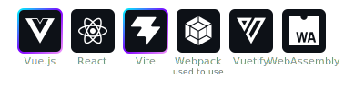
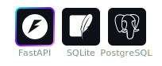
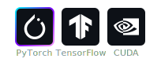
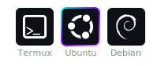

# An abnormal undergraduate student

  

My most commonly used programming languages:

My most commonly used development environments:

My frontend tech stack:

My backend tech stack:

My deep learning research:

My favorite operating systems:

✨ Icons with gradient borders are my favorites

---

### 🔬 Research

Currently conducting research in **deep learning**. Previously focused on **crowd counting**, now working on **time series prediction** and **multimodal large language models**.

Some people saw that my original profile picture was a casual snapshot of cherries in an iron basin and thought it didn't look professional enough, so I changed my profile picture to a character from an ACG game.
